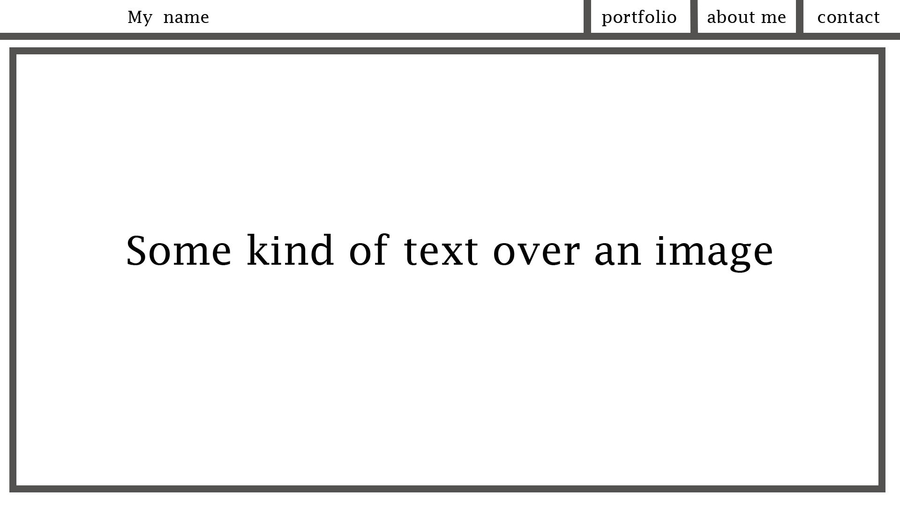
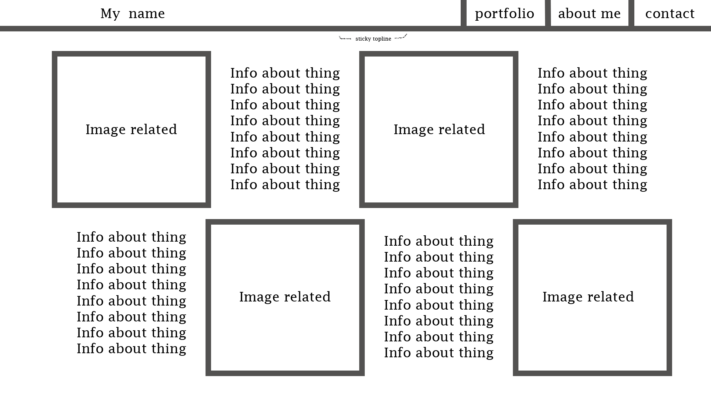
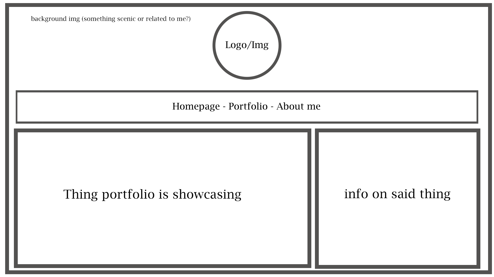
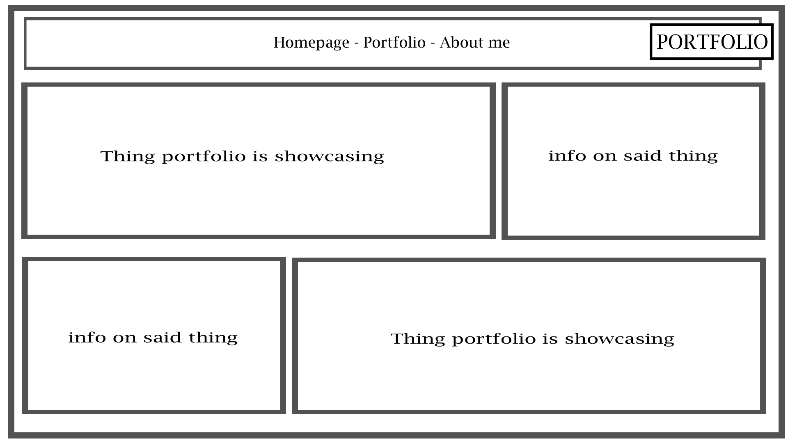
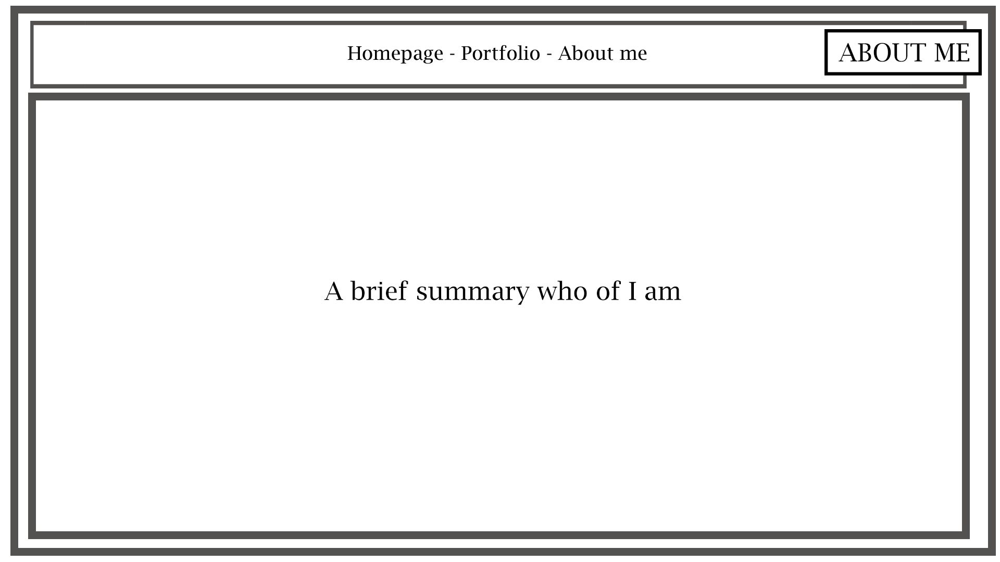

# Task 1

# Timeline

Here is the timeline I made estimating how and when I'll get everything done. Hopefully I will have things done by these dates but who knows.

# Storyboard

With my storyboard I started off with these first two pages that were pretty underdeveloped.

I made these designs just from the top of my head after looking at a few portfolios.
Giving it a go I didn't really jive with the vibe of it all so I took a step back and started over. I looked at some more portfolios online and came up with some more ideas of what to use in mine and eventually I made these boards.

I wanted to create something simple and not too complex.

The design was pretty simple and with this new set of boards ready I got to work piecing the website together.

After setting up a basic page I made some progress and tried out using an animated navigation bar that would slide into the page and have links to the other pages.

    Herb 23/05/22

I changed around how the bar navigation bar was positioned. I tried it both at the top where I had originally planned it to be in my storyboard and then at the bottom of the page. I liked how the animation worked with it sliding up and decided to deviate from my initial board design to have it below.

I then added a carousel in the center that had the main aspects of my skills that I wanted to show: MOS, Photoshop, 3D Models, Music and website creation.

The portfolio page is similar but slightly different from the initial board design. I kept the block design similar but changed the contents. Instead of one big block showcasing the images and previous works and the smaller block showcasing the info of said big block I changed it to have both block and image be put into one block of their own.

# Asset list

- Microsoft Office Specialist awards
- Level 1 unit work (Logo's, Photoshop, 3D modeling)
- Unit 13 Website

Aside the use of assets made by me I used very little in terms of others assets aside from borrowing and using snippets of code from the website W3Schools, a website built to teach and inform on how to do a variety of things with CSS or Html code among other things.

Specifically:

- Overlay effect

<https://www.w3schools.com/howto/howto_css_overlay.asp>

- CSS Animation

<https://www.w3schools.com/css/css3_animations.asp>

Other parts of code have also been lifted from my last project for Unit 13 as it was a nice easy base to start building off.

Other than the code from W3Schools the only other thing I've taken from an outside source are the badge images from Certiport / Microsoft, all of which I myself had earned by taking their exams.

# Portfolio

I want my portfolio to showcase some of my strengths in IT. I'm not too good with the technical parts, like programming a website or even just handling a git hub account without breaking it somehow, so for my achievements that I can show in IT mainly creative things I have done either on the course or off it previously. The following is a list I created that 

- Mos specialist awards (Excel, Word, Powerpoint, Word/Excel Expert)
- Examples of my photo editing work
- 3D Modelling Tinkercad
- Video Editing (Youtube)
- Unit 13's phone website
- Music, Soundcloud

#

