# Task 1

## Audience, purpose and design

#

When making my portfolio website I decided early on that I wanted the design to be personal and professional. I wanted to showcase the right aspects of me to a potential employer to make myself and my skills desirable for their needs.

My main intended audience for the website is to interest a company or potential employer looking for someone in the IT department to fill in a role of some kind related to my skill-set.

And so the purpose of course was to showcase my desirable skills that an employer would want/need from me to fill said role.

At first I wasn't quite sure what kind of skills to include because my skill-set is a bit of a jumbled mess but I figured that with the growing beast that is the IT industry my variety of versatile skills can be quite

Because of that the main purpose of the website is to show an possible employer that I have a versatile skill-set and that I could be useful for a variety of possible needed roles. Maybe a poster designer with my photoshop and different MOS application experience, perhaps a Logo designer working to create the company's new logo, a Sound designer or video editor to create video advertisements.

In conclusion...

The main audience of the website are employers looking to fill a general IT skills role. And the main purpose of the website is to showcase my versatility and wide skill-set off to said employers looking for someone to fill that IT role.

#

### Audience needs

It needs to show employers...

+ I have a good selection of IT skills (MOS, Photoshop, etc...)
+ I have good personal qualities (Versatile, Experienced, positive personality)
+ That I have qualifications

### Purpose needs

The purpose is to showcase...

+ My qualifications
+ My individual skills
+ My previous work experience
+ A bit about myself

#

## Designs

#

In this following section I'll be showcasing:

+ A timeline for the project
+ A storyboard of the layout and content of my pages
+ A structure chart of navigation routes
+ A list of ready-made assets i'm using and their sources

## Timeline

I used Adobe Express to create this timeline that sets out a rough set of dates that I aim to start and finish the content for each of the 3 tasks and the dates that I had aimed to do so.

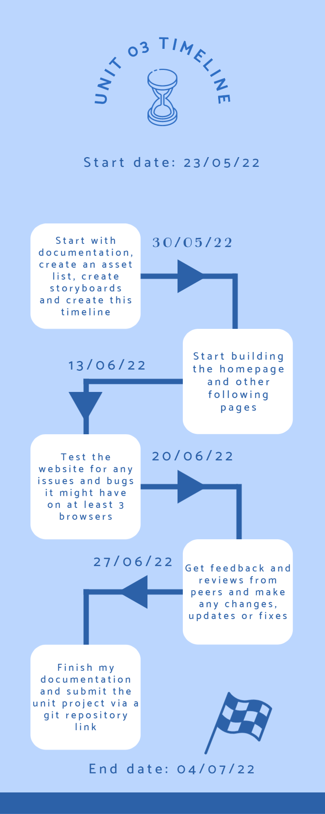

## Storyboard

With my storyboard I started off with these first two pages that were pretty underdeveloped.

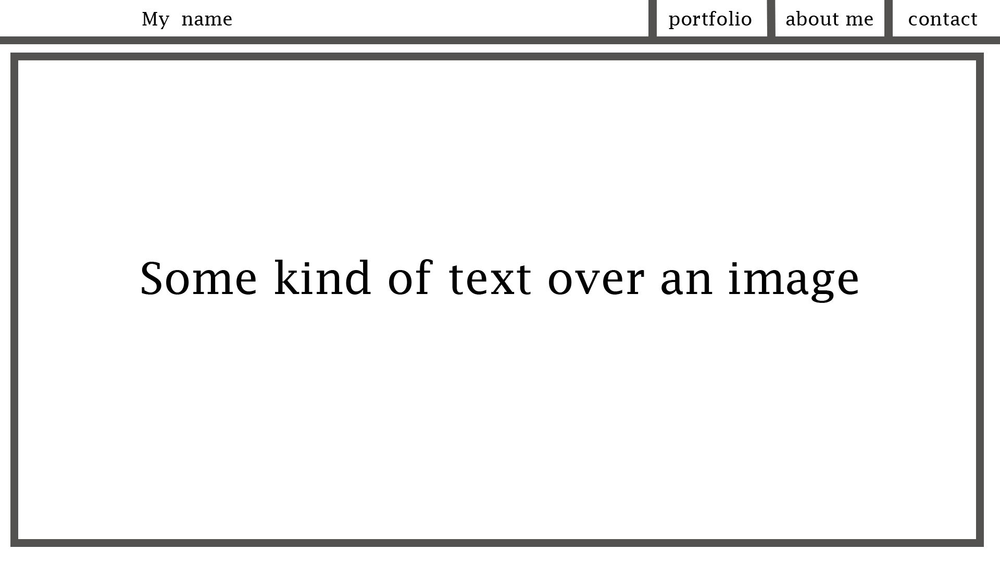
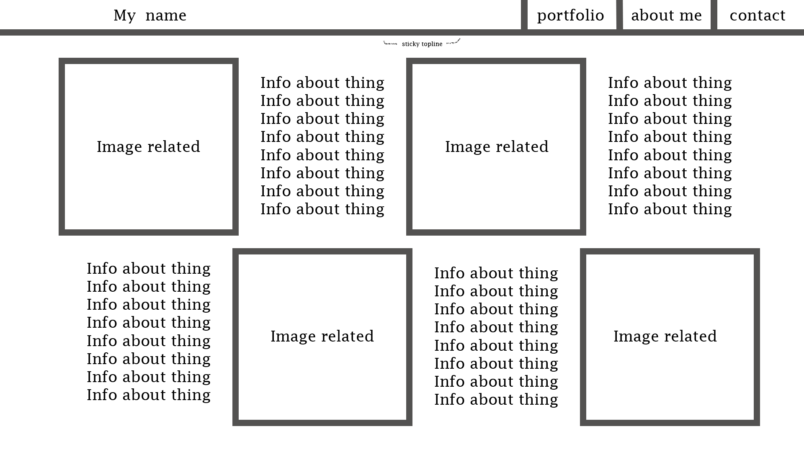

I made these designs just from the top of my head after looking at a few portfolios.
Giving it a go I didn't really jive with the vibe of it all so I took a step back and started over. I looked at some more portfolios online and came up with some more ideas of what to use in mine and eventually I made these boards.

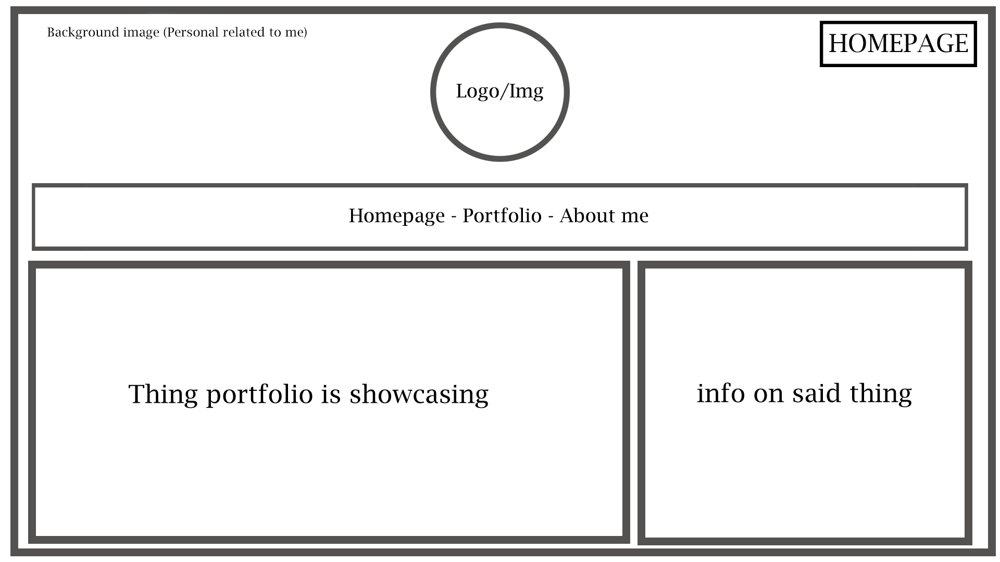

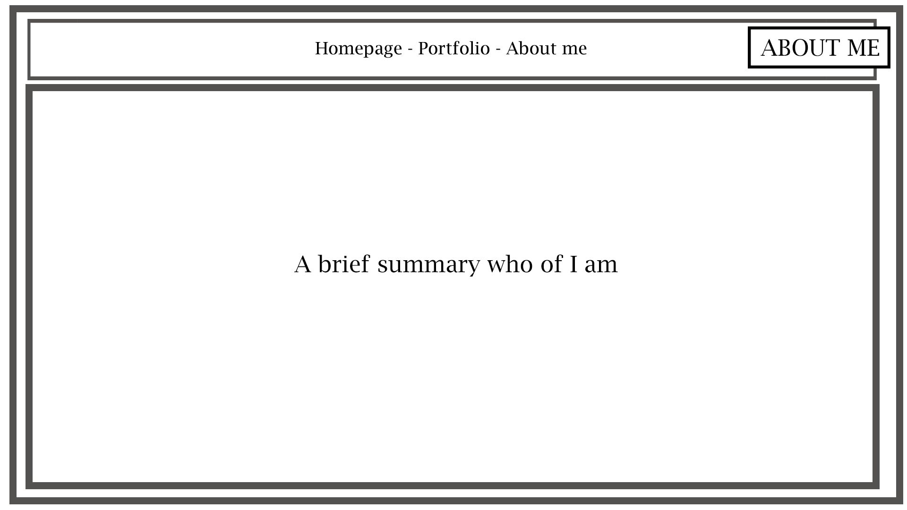

I wanted to create something simple and not too complex.

The design was pretty simple and with this new set of boards ready I got to work piecing the website together.

After setting up a basic page I made some progress and tried out using an animated navigation bar that would slide into the page and have links to the other pages.

    Herb 23/05/22

# Storyboard alterations/progress

After starting the building process of my website I changed around how the navigation bar was positioned. I tried it both at the top of the page, where I had originally planned it to be in my storyboard, and then at the bottom of the page which I ended up liking more. I tested it out with a similar animation as before but instead of sliding in from the left of the screen it rises up from the bottom. I liked how the animation worked with it sliding up and decided to deviate from my initial board design to have it below.

I then added a carousel in the center that had the main aspects of my skills that I wanted to show: MOS, Photoshop, 3D Models, Music and website creation.

The portfolio page is similar but slightly different from the initial board design. I kept the block design similar but changed the contents. Instead of one big block showcasing the images and previous works and the smaller block showcasing the info of said big block I changed it to have both block and image be put into one block of their own.

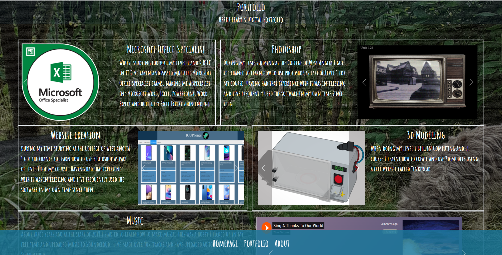

#

## Navigation chart

Chart 1: Page navigation

Below I have created a chart showing how the pages relate and which page connects where. On the main page you can navigate to either the about me or portfolio pages as it's main option alongside being able to select links embedded to the main carousel that sends you to an individual page relating to the 5 main topics I decided to showcase in my portfolio.

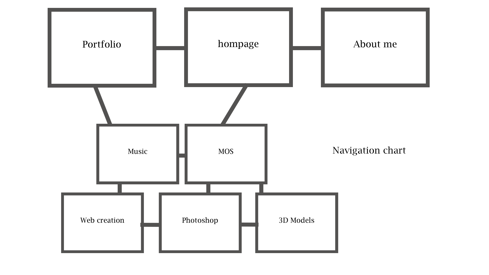

Chart 2: Navigation bar navigation

The same as the page navigation but stylized the way my main navigation bar is.

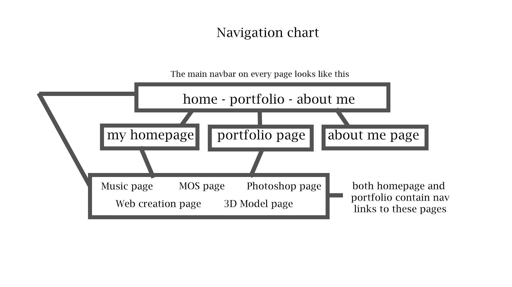

#

## Asset list

**My photos:**
Taken and owned by me.

  
    
        
            
 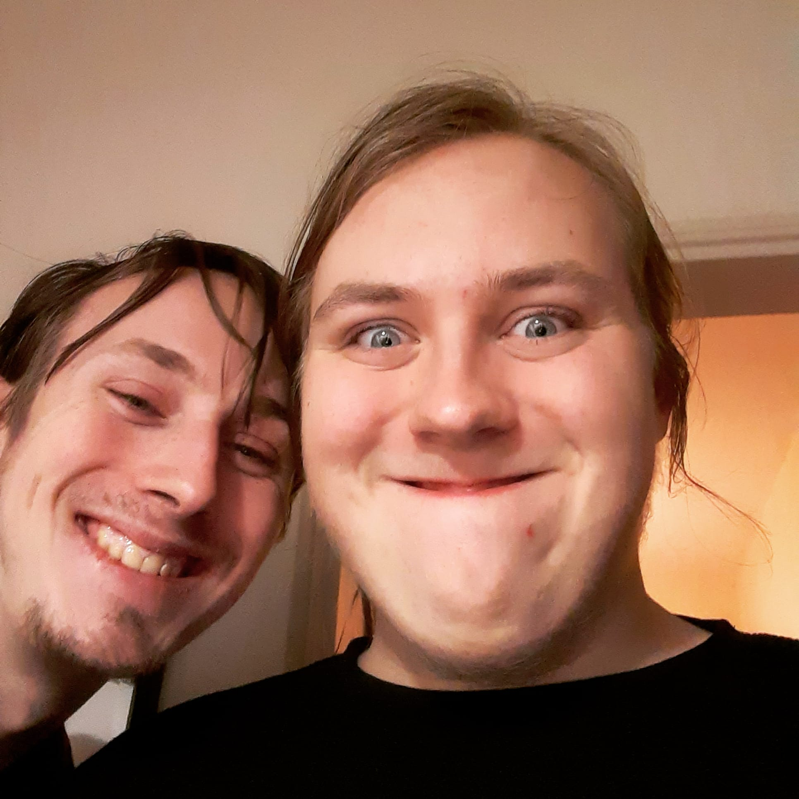
 

#

**Boards and other document related assets:**
Made using photoshop, owned by me.

  
  
  
  
  
  
  

#

**Timeline:**
My timeline was made using Adobe Express. https://express.adobe.com/sp/onboarding

#

  **Progress screenshots:**

  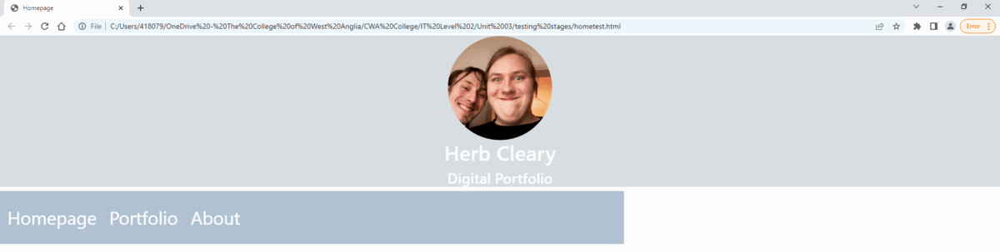
  
  
  

#

**Microsoft office 365:** 
Images are owned by Credly. https://www.credly.com/users/herb-cleary

  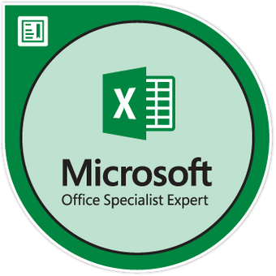
  
  
  
  
  
   

#

**Photoshop:**
All the photos shown were my own work and using my own photographs aside from the biker and the television images which I scanned from a book. I don't remember said book id or name it was like a year ago now.

  
  
  
  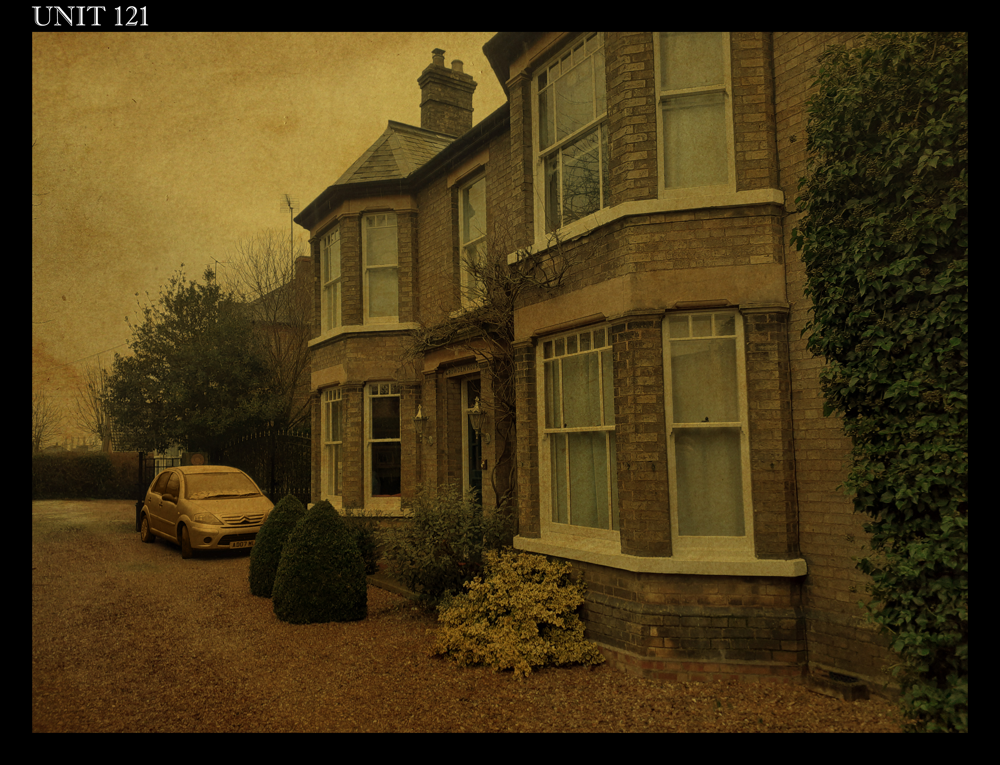
  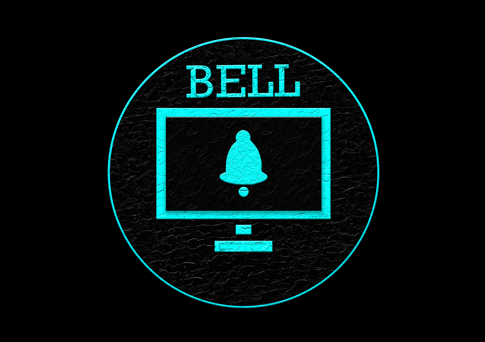
  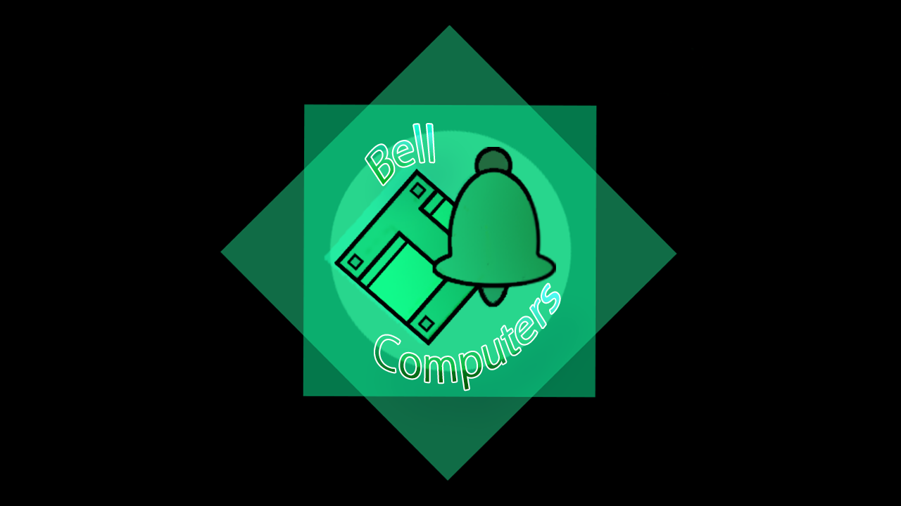
  

#

**Tinkercad:** 
All the creations shown from tinkercad are my own work and were my own. My tinkercad page: https://www.tinkercad.com/dashboard

  
  
  
  
  

#

**Unit 13 website:** 
The website was a work of my own creation and all I show off is just screenshots. The website can be found here: https://github.com/HerbCleary

  
  
  

#

**Soundcloud:** 
There isn't any music playing on the website but a few screenshots of my songs from soundcloud. https://soundcloud.com/time_to_love?utm_source=clipboard&utm_medium=text&utm_campaign=social_sharing

  
  
  
  
  

#

The overlay for the background and the css code for the navigation bar were both from W3Schools. 

Overlay effect
<https://www.w3schools.com/howto/howto_css_overlay.asp>

CSS Animation
<https://www.w3schools.com/css/css3_animations.asp>

#

<b>Text:</b> I used the font Amatic SC cursive from google fonts
https://fonts.google.com/specimen/Amatic+SC?query=amati

#

### Links

Here are links to all the stuff I used again just in case they were missed in the massive list of stuff.

+ Microsoft Office Specialist award badges
  + I used the badge png's from Credly which is here: https://www.credly.com/users/herb-cleary

+ Level 1 unit work (Logo's, Photoshop, 3D modeling)
  + Other than Tinkercad this stuff is all just my own work and there are no links. https://www.tinkercad.com/dashboard

+ Unit 13 Website
  + My github repository for my Unit 13 website: https://github.com/HerbCleary

+ Overlay effect
  + <https://www.w3schools.com/howto/howto_css_overlay.asp>

+ CSS Animation
  + <https://www.w3schools.com/css/css3_animations.asp>

+ Music
  + My own music that I've made and uploaded in my spare time. https://soundcloud.com/time_to_love?utm_source=clipboard&utm_medium=text&utm_campaign=social_sharing

# Portfolio

I want my portfolio to showcase some of my strengths in IT. I'm not too good with the technical parts, like programming a website or even just handling a git hub account without breaking it somehow, so for my achievements that I can show in IT mainly creative things I have done either on the course or off it previously.

The main skills I want to include and show off:

+ Mos specialist awards (Excel, Word, Powerpoint, Word/Excel Expert)
+ Examples of my photo editing work
+ 3D Modelling Tinkercad
+ Unit 13's phone website
+ Music (Soundcloud)

#

Aspects I want to show off: (Creative and a learner)

Learner aspects:

+ Versatile
+ Dedicated to finishing things
+ Quick to adapt to new things

Creative aspects:

+ Photo editing
+ Music
+ Web creation

# Task 2

## Testing plan

#

To make sure the website was working I need to make sure I've tested and checked out to see if the following is all working smoothly.

+ Make sure the page links work properly (Navigation from home to portfolio, portfolio to about me and etc...)

+ Make sure the adjustments work well on different webpage views (Shrunken width different browsers so on)

+ Make sure that the website works on other browsers (Chrome, Microsoft Edge, Firefox, etc...)

+ Check any and all spelling mistakes

+ And finally, Get feedback from colleagues

#

## Testing

#

+ ## Chrome

  + I started by opening the website on Chrome. 
  On the base machine I have been building the website on everything operated and ran smoothly with no sizing issues unless the web browser window width was altered on the portfolio page. I knew from my last unit that something like this would happen but I still cannot properly adjust it without making things horribly disfigured despite my best efforts.

  + Aside from that it had very few issues and all the links and carousels worked perfectly and the pages loaded fast and with no issues.
  
  

  + When testing on another machine I immediately I encountered an issue with sizing on the Portfolio page, an issue I had many a time when making it and did my best to attempt to fix it. In the end I was unsuccessful. The closest I got to what the screen is meant to look like is by having it on 80% zoom on the page.

  
  

  + A slight oddity I found was that the link for my Tinkercad page sends you to a log in page which is required to view it. Most unfortunate but I don't know how to avoid this issue as its the same whatever link for my Tinkercad that I have tried.

  + Not much else of note other than I noticed a few spelling mistakes on a few things.

#

+ ## Microsoft Edge

  + Moving on to Microsoft Edge. 
  I loaded it up and similarly to Chrome it worked with no issues on the base machine. Sizing was fine and would only have issue if tampered with via web browser width like before.

  + The links all work fine once again and I had no issues navigating my pages aside from the previously mentioned Tinkercad link.

  

  + Similarly so as before when tested on another machine with a smaller viewport it has a tantrum and breaks sizing on the portfolio page.

  + Aside from the same results as Chrome there is nothing of note that is different or wrong with the website.

  

#

+ ## Firefox

  + Finally, Firefox. 
  I loaded it up to the same results as Chrome and edge with it working with no issues on the base machine aside from the whole sizing fiasco that occurs when web width is tampered.

  + The links are all working aside from the previously mentioned Tinkercad.

  

  + Once again when tested on another machine with a smaller viewport it disagrees with it and breaks sizing on the portfolio page.

  + Still loading just as fast as Chrome and Edge if not slightly faster by maybe a few 0.1's seconds.

  

#

# Feedback

###  Nojus
Everything looks great the disorganised boxes give it a brick like structure which looks great and the text is very detailed, the "About me" section would benefit to have more details though, and the homepage is pretty well made as well.
the only other thing i can suggest is to not sit infront of the fucking sun

### Harry
It's pretty good, you've presented pretty much anything an employer would want to know in order to offer you a job. The layout of the site is good but my only real gripe is the font. If you spend a moment reading all of the content it can go a little hard on the eyes so that you have to look away. Other than that it's pretty much perfect.

### Patryk
I really got interested (Best portfolio) on your portfolio, it gives me the vibe, and memories of my childhood. I really liked the font and the background of your dog.
You've presented the information in great detail, and appropriate, all links are working with no issue, added carousel that fits images in the boxes.

### Aiden Scowen
The font is hard to read against the background and the colour of text choice. The links could use more highlighting as they're hard to come across, they are barely noticeable without pointing out or rarely coming over them.

The layout is very nicely done, easy to go over and the content looks really great in the boxes, no over filling the boxes. The nav bar looks great, the links are nicely interactive. The pages load really fast and smooth transitions to and from pages.

### Ace
The site is very attractive and engaging. The information provided is informative and easy to understand/read, the font and background combo might be difficult to understand for some other people though. The information provides within the 'About' section is a good overview of your attributes and history and would be very useful for any employers looking at it. I don't really have any negatives besides the one mentioned previously.

### ash
The website has a lot of information about achievements which is really cool and you've gone into a lot of detail about it which is really nice for people to read. The design looks really nice and I like it because it is unique and you've got a fancy nav bar which is really cool aswell. You have nice pictures which shows what you look like which is really cool and I can see you've done a lot to make you're portfolio look really nice. Nice background. Nice pictures of your hobbies and everything looks nice. Also you taked about work experience which is really nice. overall I think 10/10

# Updates and changes

**Change 1:**

A lot of my feedback was positive and people had very little issues with the website but a common thing I did get was that the font was a bit hard to read and strained the eyes a little.

I tried changing it to a different font and gave that a try but it was a huge mess. It wasn't too bad on my homepage but had a lot of issues on my Portfolio page and was incredibly awkward and would require me to resize multiple sections of text.

**Solution: Unchanged**

I decided to drop it in the end and simply make people suffer via having to squint or look away after reading too much I guess.

#

**Change 2**

Another font related issue that someone had was that it was hard to discover the links in the Portfolio section so I tried changing it a bit to try and make it stand out.

**Solution: Made portfolio links underlined**

#

# Task 3

## Review

#

With the website complete, checked for issues and given feedback I'm here at the end to review if I feel like it's met some of the requirements and is accurately made for the intended purpose and audience I had set out to meet.

At the start of the document I made this list of what I believed to be the Audience needs and the purpose needs that I wanted the website to show.

#

    It needs to show employers...

+ I have a good selection of IT skills (MOS, Photoshop, etc...)
+ I have good personal qualities (Versatile, Experienced, positive personality)
+ That I have qualifications

#

    The purpose is to showcase...

+ My qualifications
+ My individual skills
+ My previous work experience
+ And a bit about myself

#

After reviewing my feedback and completing my website I feel that in the most case has met almost all of the individual wants and needs I originally stated for the site.

Feedback stated that the website was well made with only a few having slight issues with the site being how the font was presented and matched with the background. ***"The font is hard to read against the background"***

They were happy with the information on display and said that it fit well with how everything was presented with one of my classmates stating: ***"the 'About' section is a good overview of your attributes and history"***.

My assessors got the message that I was trying to present well and I feel quite happy with how it comes across.

In my own personal assessment of the site I think it met all of the intended criteria aside from one which is that I don't feel like it really meet the requirement I had put to show off some of my qualities.

I feel like I probably could have done something else or something better to improve how it showcases my Versatility or some of the other more personal traits I wanted to showcase. In the end there will always be something else I have to improve but as is I think the website has done pretty well and meets the standards I wanted it to meet. If only just.

#

## Review design:

In terms of design, the website went through it's changes but ultimately stayed quite true to the boards I settled on. I had liked the initial boards I had done but after I started building I found that it didn't feel quite right and didn't present as well as I hoped. I didn't feel like it was the right way to go with presenting information so I decided to scrap it and start over with new boards after looking at a few more portfolios and finding a design that I thought was better overall.

*Final design portfolio page*

  

*Original design portfolio page*

  

The end result is quite true to its origin with the only real change being where the navigation bar is and how the boxes present their information alongside an extra 5th box at the bottom.

  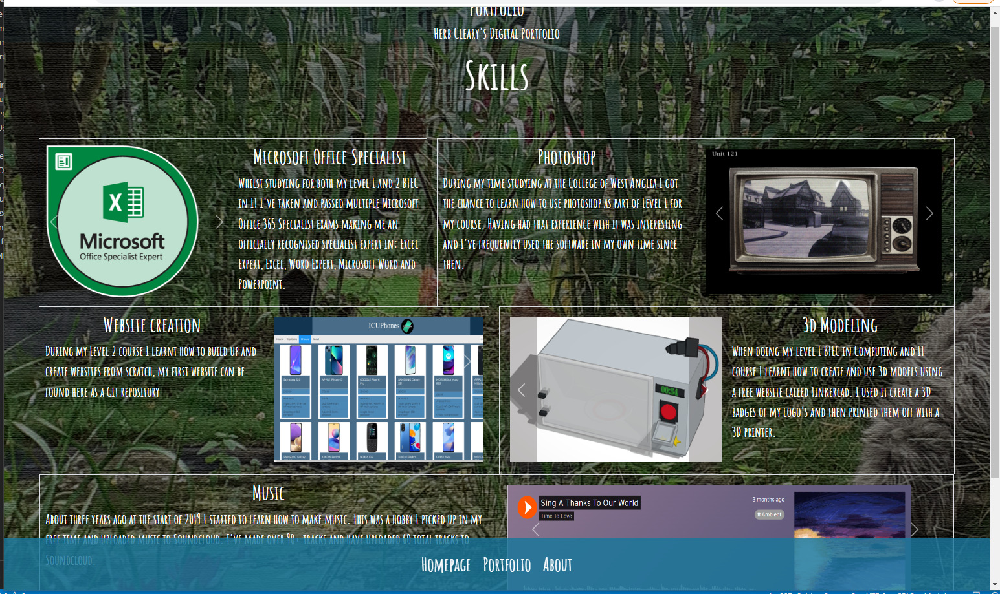

I'm happy with how the website turned out and feel like it represents me as true to me as I can be with its background, font and colour scheme overall.

# End